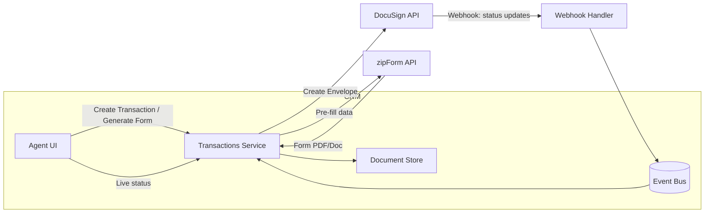
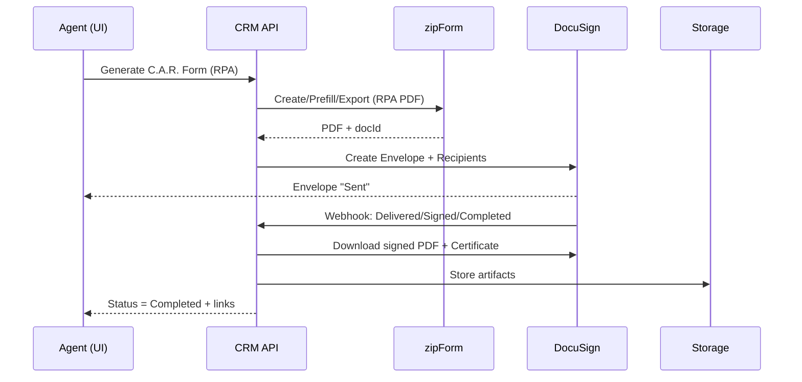

# Integration Spec: zipForm, DocuSign, and C.A.R. Forms (e-Signature) — v0.1

**Status:** Coming Soon  
**Owners:** Platform · Transactions  
**Audience:** Eng, Product, Compliance  
**Goal:** Enable agents to generate C.A.R. standard forms (via zipForm), route them for e-signature (via DocuSign), and store signed artifacts/audit trails in our CRM—fully tracked, secure, and compliant.

---

## 1) Scope & Objectives

### Scope
- Create C.A.R. forms via zipForm using CRM deal/contact data.
- Send forms for DocuSign e-signature; track status via webhooks.
- Store final PDFs + audit certificates under the CRM transaction.
- Provide status visibility (Draft → Sent → Viewed → Signed → Completed).

### Out of scope (v0):
- Deep in-app form editing (we'll rely on zipForm UI/templating).
- Multi-state forms libraries (CA first).
- Brokerage-wide content governance (basic permissions only in v0).

### Success criteria
- ≤ 3 clicks from "Generate Form" to "Send for Signature."
- 100% signed docs and audit trails are persisted to the CRM record.
- Real-time status updates (under 30s) after recipient actions.

---

## 2) Assumptions & Licenses

We (or the brokerage) maintain valid access to:
- zipForm Developer/Partner integration for C.A.R. forms.
- DocuSign eSignature (API access enabled).
- Rights to use C.A.R. standard forms digitally.
- MLS/IDX compliance handled separately; this spec covers forms + e-sign only.

---

## 3) High-Level Architecture



### Data flow (happy path)
1. Agent clicks Generate C.A.R. Form on a transaction.
2. Backend maps CRM fields → zipForm fields; requests form creation/export.
3. Backend creates DocuSign Envelope with recipients + tags.
4. DocuSign sends; we receive webhooks on status changes.
5. On completion, we download the signed PDF + Certificate → store in CRM.

---

## 4) Environment & Config

```bash
# zipForm
ZIPFORM_BASE_URL=
ZIPFORM_CLIENT_ID=
ZIPFORM_CLIENT_SECRET=
ZIPFORM_ACCOUNT_ID=
ZIPFORM_REDIRECT_URI=
ZIPFORM_WEBHOOK_SECRET= # if provided

# DocuSign
DOCUSIGN_BASE_URL=https://demo.docusign.net/restapi
DOCUSIGN_ACCOUNT_ID=
DOCUSIGN_INTEGRATOR_KEY=
DOCUSIGN_USER_ID= # GUID for JWT
DOCUSIGN_OAUTH_BASE=https://account-d.docusign.com
DOCUSIGN_RSA_PRIVATE_KEY_PATH=./secrets/docusign_private.key
DOCUSIGN_WEBHOOK_SECRET=  # optional HMAC verification

# App
APP_BASE_URL=https://app.example.com
WEBHOOK_PUBLIC_URL=https://api.example.com/integrations/webhooks/docusign
DOCUMENT_BUCKET=s3://crm-docs-prod
```

---

## 5) Data Model (additions)

### Transaction
- `id` (uuid)
- `propertyAddress`, `price`, `closeDate`, …
- `parties`: array of { `role`: 'buyer' | 'seller' | 'agent' | 'coAgent', `name`, `email` }
- `forms[]` → `FormRecord`

### FormRecord
- `id` (uuid)
- `provider`: 'zipform'
- `type`: e.g., CAR-RPA, CAR-LA, …
- `zipformTransactionId`
- `zipformDocumentId`
- `docusignEnvelopeId`
- `status`: 'draft'|'sent'|'delivered'|'completed'|'declined'|'voided'
- `files`: { `originalPdfUrl`, `signedPdfUrl`, `auditCertUrl` }
- `timeline[]`: timestamped events

---

## 6) API (Backend) — Endpoints

All endpoints require auth (agent/team/broker roles), and permission checks on the transaction.

### 6.1 Generate form (zipForm)

**POST** `/api/transactions/:id/forms/generate`

**Body:**
```json
{
  "formType": "CAR-RPA", 
  "prefillOverrides": { "PurchasePrice": 825000 }
}
```

**Response:**
```json
{
  "formRecordId": "uuid",
  "status": "draft",
  "zipformTransactionId": "zf_tx_123",
  "zipformDocumentId": "zf_doc_456"
}
```

### 6.2 Send for signature (DocuSign)

**POST** `/api/forms/:formRecordId/send`

**Body:**
```json
{
  "recipients": [
    { "role": "buyer", "name": "Alex Buyer", "email": "alex@example.com", "routingOrder": 1 },
    { "role": "seller", "name": "Sam Seller", "email": "sam@example.com", "routingOrder": 2 }
  ],
  "message": "Please review and sign the Residential Purchase Agreement."
}
```

**Response:**
```json
{ "docusignEnvelopeId": "xxxx-xxxx-xxxx", "status": "sent" }
```

### 6.3 List/refresh status

**GET** `/api/forms/:formRecordId/status` → `{ status, recipients[] }`  
**POST** `/api/forms/:formRecordId/refresh` → pulls latest from DocuSign

### 6.4 Download artifacts

**GET** `/api/forms/:formRecordId/files` → `{ originalPdfUrl, signedPdfUrl, auditCertUrl }`

---

## 7) Webhooks (DocuSign)

**Endpoint:** `POST /integrations/webhooks/docusign`

- Verify HMAC (if configured) or DocuSign Connect signature.
- Parse envelope events: Sent, Delivered, Completed, Declined, Voided.
- Update `FormRecord.status`, append to timeline, on Completed:
  - Download Signed PDF + Certificate of Completion.
  - Store in `DOCUMENT_BUCKET`, persist URLs on the `FormRecord`.
- Emit internal event: `forms.signed`.

### Example Express handler (TS)

```typescript
import { Request, Response } from "express";
import crypto from "crypto";
import { handleEnvelopeEvent } from "@/services/docusign";

export async function docusignWebhook(req: Request, res: Response) {
  const sig = req.header("x-docusign-signature");
  if (process.env.DOCUSIGN_WEBHOOK_SECRET) {
    const hmac = crypto.createHmac("sha256", process.env.DOCUSIGN_WEBHOOK_SECRET!)
      .update(req.rawBody) // ensure raw body middleware
      .digest("base64");
    if (hmac !== sig) return res.status(401).send("Invalid signature");
  }

  try {
    const event = await handleEnvelopeEvent(req.body);
    return res.status(200).json({ ok: true, event });
  } catch (e) {
    console.error(e);
    return res.status(500).json({ ok: false });
  }
}
```

---

## 8) Service Layer Stubs (TypeScript)

### 8.1 zipForm adapter

See `services/zipform.ts` for implementation.

```typescript
// services/zipform.ts
export async function createZipformDocument(params: {
  transactionId: string;          // CRM transaction id
  carFormCode: string;            // e.g. "RPA"
  prefill: Record<string, any>;   // mapped fields
}) {
  // 1) Ensure we have zipForm OAuth token
  // 2) Create/locate zipForm "Transaction"
  // 3) Create Document from library (C.A.R. form code)
  // 4) Merge prefill data
  // 5) Export to PDF (or return docId if DocuSign pulls from zipForm directly)
  // Return { zipformTransactionId, zipformDocumentId, pdfBuffer? }
  return { zipformTransactionId: "zf_tx_123", zipformDocumentId: "zf_doc_456" };
}
```

### 8.2 DocuSign adapter

See `services/docusign.ts` for implementation.

```typescript
// services/docusign.ts
import { EnvelopesApi, ApiClient } from "docusign-esign";

export async function createEnvelopeFromPdf(params: {
  pdfBuffer: Buffer;
  filename: string;
  recipients: Array<{name:string; email:string; routingOrder:number; role?:string;}>;
  subject: string;
  message: string;
}) {
  const apiClient = new ApiClient();
  // configure JWT auth, base path, accountId...
  const envelopesApi = new EnvelopesApi(apiClient);

  // Build envelope definition with document + signHere tabs per recipient.
  // For production, use DocuSign templates and anchor tagging where possible.

  const envelopeId = "generated-envelope-id";
  return { envelopeId, status: "sent" };
}

export async function handleEnvelopeEvent(body: any) {
  // Map DocuSign Connect payload => our internal event shape
  // On Completed: pull documents
  return { type: "completed", envelopeId: "..." };
}

export async function downloadCompletedDocuments(envelopeId: string) {
  // Download combined PDF and certificate of completion
  // Return buffers or persist directly to object storage
  return { signedPdfUrl: "s3://...", auditCertUrl: "s3://..." };
}
```

---

## 9) Field Mapping (example)

| CRM Field | zipForm Field (example) | Notes |
|-----------|------------------------|-------|
| `transaction.price` | `PurchasePrice` | Number; ensure currency formatting |
| `transaction.propertyAddress` | `Property.Address` | Street/City/State/ZIP split if needed |
| `buyer.name` / `.email` | `Buyer1.Name/Email` | Repeat for co-buyer |
| `seller.name` / `.email` | `Seller1.Name/Email` | Repeat for co-seller |
| `agent.name` / `.dreNumber` | `AgentInfo` | License required on some forms |

Maintain a versioned mapping table; C.A.R. forms update periodically.

---

## 10) UX Flows



### Agent UI
- Transaction → Forms tab:
  - "Generate form" (select C.A.R. code), preview, Send for signature.
  - Live status chips: Draft / Sent / Delivered / Completed / Declined.
  - Links to Signed PDF + Certificate.

---

## 11) Permissions & Compliance

### Role-based access:
- **Agent:** create/send/view own transaction forms.
- **Assistant:** create/view; send if delegated.
- **Broker Admin:** org-wide visibility, export logs.

### Compliance:
- Store Certificate of Completion for every envelope.
- Immutability: prevent modification of signed PDFs; write-once storage class.
- Retention: default 7 years (configurable per brokerage/policy).
- Privacy: honor opt-outs; least-privilege document access.
- Audit: event log for create/send/download actions.

---

## 12) Errors, Retries, Observability

- zipForm/DocuSign network errors → exponential backoff (max 5 retries).
- Webhook idempotency: dedupe by `envelopeId` + `eventTimestamp`.
- Alerting: on failed envelope creation, failed artifact download, or 24h unsigned.
- Dashboards: envelopes by status; avg time to complete; failure rates.

---

## 13) Testing Plan

- Sandbox credentials for both providers.
- Unit tests: mapping, adapters, webhook handler.
- E2E tests:
  - Single signer, multi-signer, routing order, decline/void.
  - Large PDFs; mobile signing.
- Security tests: authorization on file downloads; webhook signature verification.

---

## 14) Rollout Plan

- **Phase 1:** Internal pilot (1–3 agents).
- **Phase 2:** Team pilot (≤ 20 users), feedback + polish.
- **Phase 3:** Brokerage rollout, training, and migration guide.

---

## 15) "Coming Soon" Marketing Blurb (copy/paste)

> **C.A.R. Forms + DocuSign in One Click**
> 
> Generate California Association of REALTORS® forms with your deal data pre-filled, send for DocuSign e-signature, and track status in real time—without leaving the CRM. Signed PDFs and Certificates are stored automatically with each transaction. Faster deals, fewer clicks, full compliance.

---

## 16) Open Questions

- Which C.A.R. forms are in our MVP list (RPA, LA, TDS, AVID, etc.)?
- Default routing order per form (e.g., buyer before seller)?
- Broker-level branding and defaults (email subject, message templates)?
- Document retention per office policy?

---

## 17) Developer Checklist

- [ ] Add env vars/secrets (zipForm, DocuSign).
- [ ] Implement `zipFormAdapter.createZipformDocument()`.
- [ ] Implement DocuSign JWT auth & `createEnvelopeFromPdf()`.
- [ ] Build `/forms/generate`, `/forms/:id/send`, `/forms/:id/status`.
- [ ] Build `/integrations/webhooks/docusign` with signature verify.
- [ ] Persist files to `DOCUMENT_BUCKET` and URLs to `FormRecord`.
- [ ] Add UI: Generate → Preview → Send → Status → Download.
- [ ] Add metrics + alerts; write internal runbook.
- [ ] Pilot with sandbox accounts; record timings and issues.

---

## Notes for Implementation

- Service stubs are located in:
  - `services/zipform.ts`
  - `services/docusign.ts`
- Route handlers are located in:
  - `routes/forms.ts`
  - `routes/webhooks.ts`
- Environment variables should be added to `.env.example` (see §4).

---

**Last Updated:** December 2024  
**Version:** 0.1  
**Status:** Coming Soon

